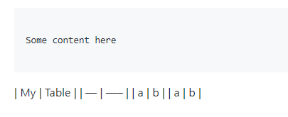

# Description
Just testing some line break behaviour

Other research:
* https://forum.obsidian.md/t/line-break-should-not-be-necessary-before-the-table-strict-line-breaks-disabled/74533

## What we are trying to avoid

It seems that, without a line break, it doesn't render the table:



# Tests

## Test1 (no line break)

```

Some content here

```
| My  | Table |
| --- | ----- |
| a   | b     |
| a   | b     |


## Test 2 (with line break)

```

Some content here

```

| My  | Table |
| --- | ----- |
| a   | b     |
| a   | b     |